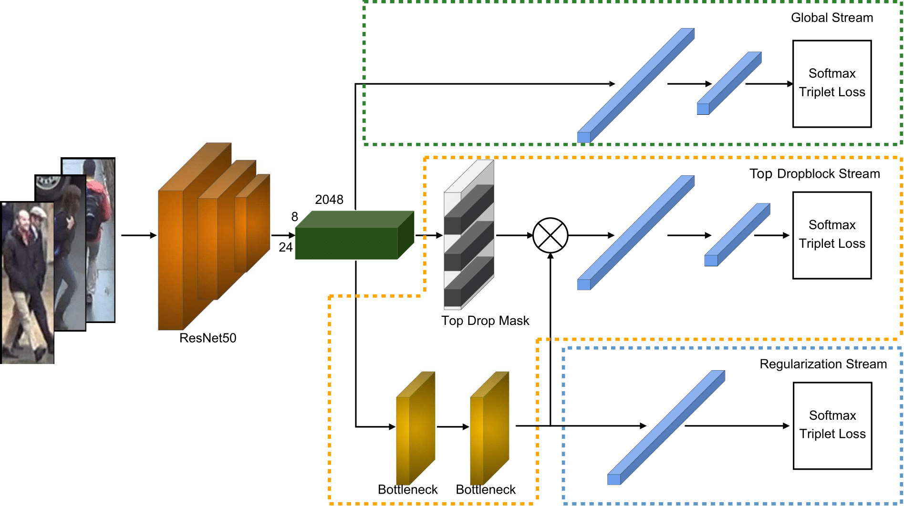

[](https://arxiv.org/abs/2010.05435)
[](https://paperswithcode.com/sota/person-re-identification-on-cuhk03-detected?p=top-db-net-top-dropblock-for-activation)
[](https://paperswithcode.com/sota/person-re-identification-on-cuhk03-labeled?p=top-db-net-top-dropblock-for-activation)
[](https://paperswithcode.com/sota/person-re-identification-on-dukemtmc-reid?p=top-db-net-top-dropblock-for-activation)
[](https://paperswithcode.com/sota/person-re-identification-on-market-1501?p=top-db-net-top-dropblock-for-activation)

Top-DB-Net: Top DropBlock for Activation Enhancement in Person Re-Identification
===========

This repository implements 'Top-DB-Net: Top DropBlock for Activation Enhancement in Person Re-Identification' presented at International Conference in Pattern Recognition (ICPR 2020)



## Installation

Make sure your [conda](https://www.anaconda.com/distribution/) is installed.

```bash
# cd to your preferred directory and clone this repo
git clone https://github.com/RQuispeC/top-dropblock.git

# create environment
cd top-dropblock/
conda create --name topdropblock python=3.7
conda activate topdropblock

# install dependencies
# make sure `which python` and `which pip` point to the correct path
pip install -r requirements.txt

# install torch and torchvision (select the proper cuda version to suit your machine)
conda install pytorch torchvision cudatoolkit=9.0 -c pytorch
```

## Train and Test

We made available config files for training and testing inside `configs`. For instance, to train Top-DBnet on Market-1501, run:

```bash
python main.py \
--config-file configs/im_top_bdnet_train_market1501.yaml \
--root $PATH_TO_DATA
```

To test Top-DBnet, update `configs/im_top_bdnet_test.yaml` with the dataset name and path to saved model:

```yaml
model:
    load_weights: $PATH_TO_MODEL

test:
    rerank: False # Update this if you want to use re-ranking
    visrank: False # Update this if you want to visualize activation maps
    targets: ['cuhk03'] # Dataset name, e.g. ('cuhk03', 'market1501', 'dukemtmcreid')
```

Then do

```bash
python main.py \
--config-file configs/im_top_bdnet_test.yaml \
--root $PATH_TO_DATA
```
Trained models are available [here](https://drive.google.com/drive/folders/1GJLUnYw-UUyM6kgJHCeFszxq3_3JTeTy?usp=sharing)


To output activations maps update `visrankactivthr: True` or `visrankactiv: True` on the config files.

<p align="center">
    
</p>

Results
--------

| Dataset       | mAP  | Rank-1 | mAP (RK)| Rank-1 (RK)  | 
| ------------- |:----:|:------:|:-------:|:------------:|
| Market1501    | 85.8 | 94.9   | 94.1    | 95.5         |
| DukeMTMC-ReID | 73.5 | 87.5   | 88.6    | 90.9         |
| CUHK03(L)     | 75.4 | 79.4   | 88.5    | 86.7         |
| CUHK03(D)     | 74.2 | 77.3   | 86.9    | 85.7         |


Citation
---------
If you find this work useful to your research, please cite the following publication.

```
@article{quispe2020topdnet,
  title={Top-DB-Net: Top DropBlock for Activation Enhancement in Person Re-Identification},
  author={Quispe, Rodolfo and Pedrini, Helio},
  journal={25th International Conference on Pattern Recognition},
  year={2020}
}
```

This repo is based on [deep-person-reid](https://github.com/KaiyangZhou/deep-person-reid), for further questions regarding data setup and others take a look to their [documentation](https://kaiyangzhou.github.io/deep-person-reid/).


News
--------
* Updated figure of architecture to match code implementation (refer to [#4](https://github.com/RQuispeC/top-dropblock/issues/4))
